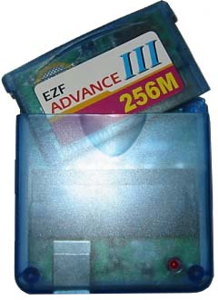
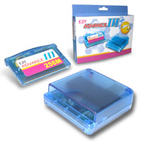

# EZF Advance III opensource alternative software

 

Please look at 
[Project Summary](ezfadvanceIII_project_summary.md) 
and 
[Detailed documentation](ezfadvanceIII_project_technical_documentation.md) 
to learn more

## Build and test

The command-line tools require a C++17 compiler and libusb 1.0:

```sh
make
```

Offline tests do not access an EZ-Flash device and do not erase or program a
cartridge:

```sh
make test
```

The code is organized in layers:

- `UsbDevice` owns the libusb context, device handle, and claimed interface.
- `Transport` abstracts bulk transfers; `BulkTransport` is the libusb implementation.
- `Protocol` implements shared EZ3 command/data/echo transactions.
- `ReadOnlyCartridge` owns the capture-derived initialization and ROM-read state machine.
- `GbaHeader`, `CatalogEntry`, and `CartridgeFormat` model cartridge metadata.
- `SaveMemoryReader` owns capture-proven save-bank reads.
- `VerificationSession` owns the transcript-tested partial first-window, exact 8/16/24 MiB, and tiny-tail-above-16-MiB verification paths.
- `CartridgeImageBuilder`, `CardWriter`, `CardInspector`, `SaveExtractor`, and `CardEraser` implement the four application workflows.

## Project status

This project is a working community-developed alternative for EZF Advance III
hardware. Its core workflows are covered by offline tests, and supported write
and read-back verification paths have been exercised successfully on real
hardware. Development and reverse engineering are still ongoing, so hardware
and cartridge configurations outside the documented and tested paths may not
behave as expected.

Hardware tests are intentionally separate because writer and wipe operations
are destructive. Always run a dry-run writer command first and review its
layout before supplying `--yes-really-write`.

## Disclaimer

### Independent project / no affiliation or endorsement

This is an **independent, unofficial, community-developed project**. It is **not affiliated with, associated with, authorized by, endorsed by, sponsored by, supported by, or otherwise connected with Nintendo Co., Ltd., any Nintendo affiliate, the EZ-Flash Team, or any related manufacturer, developer, distributor, or rights holder**.

Nintendo, Game Boy Advance, EZ-Flash, EZF Advance III, and any other product names, trademarks, service marks, logos, or brands referenced by this project remain the property of their respective owners. Their use in this repository is solely for identification, compatibility, interoperability, technical documentation, and descriptive purposes and does not imply any affiliation, endorsement, sponsorship, approval, or support.

**Neither Nintendo nor the EZ-Flash Team provides support for this project.** Questions, bug reports, compatibility issues, device problems, or damage arising from this software should not be directed to Nintendo, the EZ-Flash Team, or their respective affiliates, employees, distributors, or support channels.

### Project origin and purpose

This project was started because the original software and drivers for the **EZF Advance III** are available for and operational with **Windows XP**, an operating system that is now very old and no longer a practical or desirable platform for many users.

The purpose of this project is therefore to research, document, and develop an independent alternative that can help preserve continued use of existing EZF Advance III hardware on modern Unix-like systems, without requiring the original Windows XP environment. The project is focused on compatibility and interoperability with hardware that users already own; it is not intended to represent, replace, or imply official software, drivers, support, or endorsement from Nintendo or the EZ-Flash Team.

We hope that someone with the necessary technical knowledge and interest will **fork this repository and continue the project further**. This repository is shared as a working community-developed alternative and as a record of the work already done, in the hope that others may improve, correct, document, and extend it.

This software and project are provided **“AS IS” and “AS AVAILABLE,” without warranty of any kind**, express or implied.

This project remains under active development and may contain bugs, incomplete features, incorrect assumptions, or unexpected behavior, particularly on hardware and configurations that have not yet been tested. Use of this software may cause data loss, corruption, malfunction, permanent damage, or otherwise render an **EZF Avance III Device partially or completely unusable (“bricked”)**.

A substantial portion of this project was created through **“vibe coding,” reverse engineering, experimentation, and the use of AI-assisted development tools, including ChatGPT**. As a result, the code may contain errors, inaccurate implementations, undocumented behavior, or functionality that has not been thoroughly tested or independently verified.

The owner of this Git repository **does not claim to possess the technical expertise, engineering qualifications, or detailed knowledge necessary to guarantee the correctness or safety of the software**. The repository owner may also be unable to provide technical support, debugging assistance, device recovery assistance, repair instructions, or further development support if the software causes problems or damages an EZF Avance III Device.

By downloading, installing, modifying, executing, flashing, or otherwise using this software, you acknowledge and accept that you do so **entirely at your own risk**.

To the maximum extent permitted by applicable law, the author(s), contributor(s), and maintainer(s) of this project shall not be liable for any direct, indirect, incidental, special, consequential, or other damages arising from or related to the use or inability to use this software, including, without limitation, damage to hardware, loss or corruption of data, loss of functionality, device failure, or the permanent bricking of an EZF Avance III Device.

**You are solely responsible for understanding the risks, making appropriate backups where possible, verifying the software before use, and determining whether you are willing to accept the possibility of permanently damaging your EZF Avance III Device.**

Do not use this software on any device that you are not prepared to potentially damage or lose. Use this project only if you fully understand and accept these risks.
